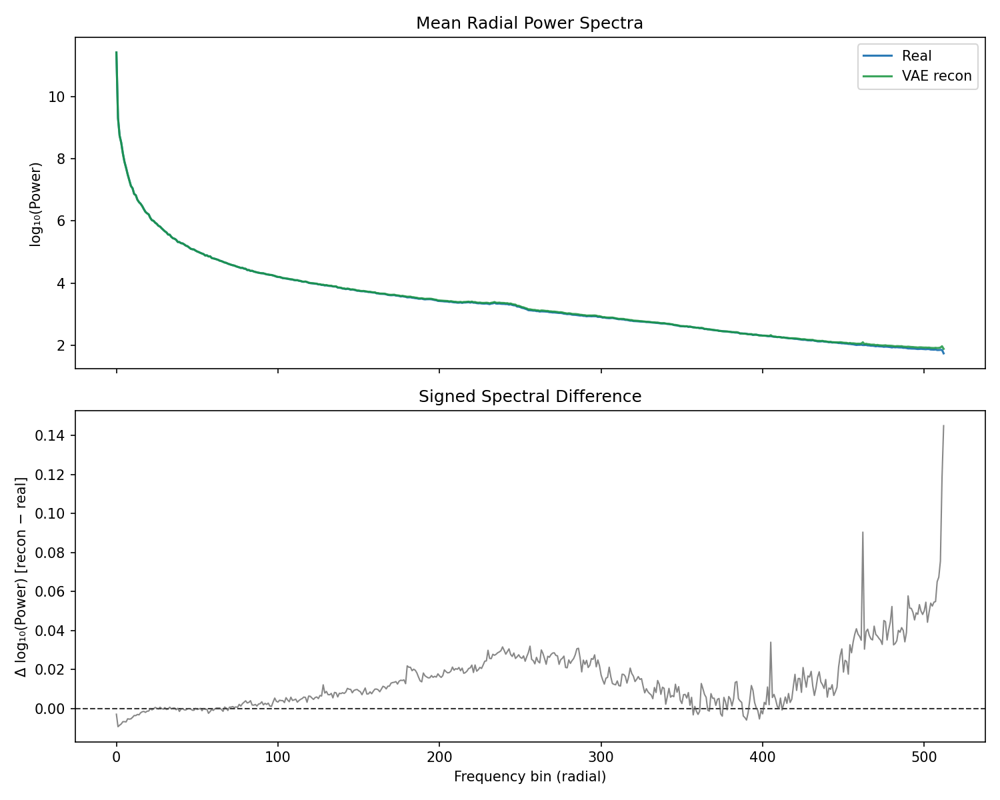
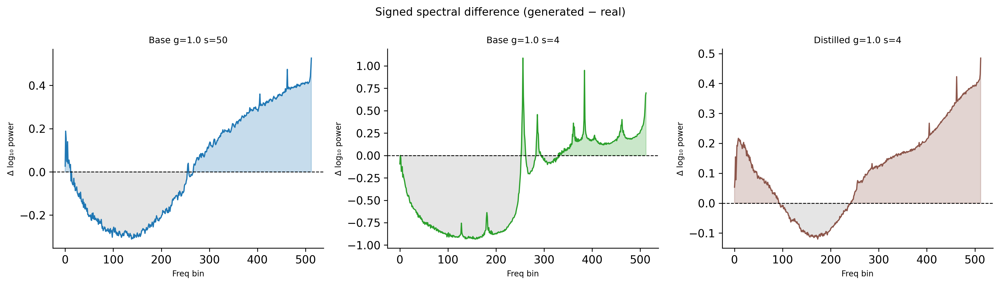

# Spectral Forensic Characterization of FLUX.2 Image Generation Models

This project applies azimuthal spectral averaging (Keuper et al., CVPR 2020) to FLUX.2 image generation models, comparing the radial power spectra of generated face images against 200 real FFHQ photographs. The main observation is that the LADD-trained distilled model produces spectrally near-identical output to real images (Δslope +0.016), while the MSE-trained base model does not at any tested inference setting (+0.195 to +0.693), and this difference persists when inference parameters are matched, suggesting the training objective, not inference configuration, is the primary factor.


*2D log-power spectra (|F(u,v)|², DC-centered) for real FFHQ images and three FLUX.2 model variants. The isotropic falloff confirms no directional grid artifacts.*

---

## Motivation

Keuper et al. (CVPR 2020) showed that GAN-based generators fail to reproduce the spectral distributions of real images. The artifact was characteristic: under-production of high-frequency content by orders of magnitude, attributable to transposed convolution checkerboard patterns. Modern rectified flow transformers (FLUX.2) use a fundamentally different architecture: patch-based vision transformers with rotary positional embeddings and a flow matching training objective. This project asks whether these models exhibit analogous spectral artifacts, and if so, how they differ from the GAN case.

---

## Methodology

**Spectral pipeline (replicating Keuper et al.):**
1. Convert images to grayscale (luminance channel)
2. Compute 2D DFT via `np.fft.fft2`, shift DC to center with `np.fft.fftshift`
3. Compute power spectrum: |F(u,v)|²
4. Azimuthal average: for each integer radius r, average all power values at distance r from center. This produces a 1D spectrum of length 513 for 1024×1024 images
5. Population statistics: mean and standard deviation across N images per group
6. Spectral slope: log-log linear fit restricted to bins 10–400 (excludes DC and Nyquist edge)

**Reference dataset:** 200 randomly sampled FFHQ images at 1024×1024

**Models tested:**
- Klein 4B Distilled — LADD adversarial distillation, 4 steps, guidance=1.0 (n=200)
- Klein 4B Base — MSE flow matching, 50 steps, guidance=4.0 (n=41)
- FLUX.2 Max — BFL Playground, inference parameters unknown (n=20)

**Control experiments:**
- Degradation controls: Gaussian blur (σ=1.5), 2× downscale/upscale (512→1024), JPEG Q85 applied to real images
- VAE round-trip: 50 real images encoded and decoded through the FLUX VAE to isolate the decoder's contribution

**Ablation:** Guidance × steps grid using Klein Base at varying (steps, guidance) combinations to disentangle inference parameters from training objective effects.

---

## Results

### Spectral Fingerprint

FLUX-generated images exhibit a spectral fingerprint reversed from GANs: mid-frequency under-production (bins 50–250) and high-frequency over-production (bins 350–512). The effect magnitude is approximately 0.3–0.4 log₁₀ in power. These are orders of magnitude smaller than GAN-era artifacts documented by Keuper et al. The fingerprint is isotropic; no directional grid artifacts are present. A logistic regression classifier achieves 0.983 AUC (±0.014) on same-domain, uncompressed data.

### VAE Isolation

The VAE round-trip experiment produces zero statistically significant frequency bins (p < 0.05) across all 513 bins. Mean absolute deviation: 0.015 log₁₀. The VAE decoder is spectrally transparent. The fingerprint originates in the flow-matching denoising process.


*Encoding and decoding 50 real images through the FLUX VAE produces no statistically significant spectral deviation. The difference signal is indistinguishable from noise across all 513 frequency bins.*

### Degradation Controls

| Condition | Δ slope vs. real |
|---|---|
| JPEG Q85 | −0.015 |
| Downscale 512→1024 | −0.643 |
| Gaussian blur σ=1.5 | −0.806 |
| Klein Distilled | +0.016 |
| Klein Base g=4.0 s=50 | +0.195 |
| FLUX.2 Max | +0.223 |

Degradations push spectral slope steeper (less high-frequency content). FLUX generation pushes it shallower (more high-frequency content). These are opposite effects: the FLUX fingerprint is not a quality artifact.

### Guidance × Steps Ablation

| Condition | Training | Steps | Guidance | n | Δ Slope |
|---|---|---|---|---|---|
| Distilled | LADD | 4 | 1.0 | 200 | +0.016 |
| Base A | MSE | 50 | 4.0 | 41 | +0.195 |
| Base B | MSE | 50 | 1.0 | 19 | +0.316 |
| Base D | MSE | 4 | 1.0 | 56 | +0.693 |

**Guidance does not explain the distilled model's spectral realism.** Lowering guidance from 4.0 to 1.0 on the base model increases the spectral deviation (+0.195 → +0.316), not decreases it.

**LADD training is the remaining candidate.** At matched inference settings (g=1.0, s=4), the base model shows a 44× larger slope deviation than the distilled model. However, this comparison is confounded: the base model produces degraded images at 4 steps (outside its design parameters), so the training objective effect cannot be cleanly separated from image quality degradation.


*Signed spectral differences across three inference conditions. Left: Base at 50 steps (smooth W-shape). Centre: Base at 4 steps (severe instability, wild high-frequency spikes). Right: Distilled LADD at 4 steps (near-flat, Δ≈0).*

### FLUX.2 Max

The fingerprint persists in BFL's flagship model (Δslope +0.223, n=20). The shape differs — Max shows deeper mid-frequency under-production as its dominant feature. Small sample size limits interpretive weight.

---

## Limitations

- **Undisclosed training data.** FLUX training data composition is unknown. Spectral differences may partly reflect training distribution mismatch with FFHQ rather than architectural properties.
- **Cross-distribution comparison.** Unlike Keuper et al., where GANs were trained on the reference dataset, FLUX was not (or may not have been) trained on FFHQ.
- **Small sample sizes** for base model conditions (n=19–56) and FLUX.2 Max (n=20).
- **Prompt conditioning confound.** Text-guided generation may introduce spectral biases absent in unconditional generation.
- **Detection on clean lab data only.** Robustness to JPEG, resizing, and social media pipelines is untested. The high-frequency bins where the fingerprint concentrates are the first destroyed by compression.
- **LADD isolation confounded by image quality.** The base model at 4 steps produces degraded output. The training objective effect and image quality effect are inseparable with available models.
- **Effect magnitude is small.** At 0.3–0.4 log₁₀, the fingerprint is near the threshold where content variation and post-processing could mask it.

---

## Directions Not Pursued

- **Stable Diffusion 3 comparison:** Would test cross-architecture generality (SD3 shares the MM-DiT family and uses LADD). Deferred due to generation cost — better suited for thesis-scale work.
- **Social media robustness:** The fingerprint concentrates in high-frequency bins that JPEG and downscaling destroy first. The expected outcome is predictable.
- **Directional anisotropy analysis:** RoPE and patch tokenization may create directional biases invisible to azimuthal averaging. Infrastructure exists (`src/controls/directional.py`) but this is a separate investigation.
- **Extended classifier development:** The 0.983 AUC on controlled data is an expected baseline. Improving it does not advance understanding of the phenomenon.

---

## Repository Structure

```
flux/
├── configs/experiment.yaml
├── data/
│   ├── real/                          # 200 FFHQ images (1024×1024 PNG)
│   └── generated/
│       ├── klein_distilled/           # 200 images (LADD, s=4, g=1.0)
│       ├── klein_base_g4_s50/         # ~41 images (MSE, s=50, g=4.0)
│       ├── klein_base_g1_s50/         # ~19 images (MSE, s=50, g=1.0)
│       ├── klein_base_g1_s4/          # ~56 images (MSE, s=4, g=1.0)
│       ├── flux2_max/                 # ~20 images (BFL Playground)
│       └── vae_roundtrip/             # 50 VAE encode-decode reconstructions
├── src/
│   ├── spectral/                      # FFT, azimuthal averaging, metrics, stats
│   ├── detection/                     # Feature extraction, classifiers with CV
│   ├── controls/                      # Degradation methods, directional analysis
│   └── visualization/                 # Plotting functions
├── scripts/
│   ├── run_analysis.py                # Per-model spectral analysis
│   ├── run_controls.py                # Degradation controls
│   ├── run_detection.py               # Detection experiment
│   ├── run_grid_analysis.py           # Guidance × steps ablation
│   └── run_vae_roundtrip.py           # VAE isolation experiment
└── results/
    ├── klein_distilled/               # figures/ + metrics.json
    ├── klein_base_g4_s50/
    ├── flux2_max/
    ├── vae_roundtrip/
    ├── controls/
    └── grid_ablation/                 # Grid comparison plots + JSON
```

---

## How to Reproduce

```bash
# Install
pip install numpy scipy scikit-learn matplotlib seaborn pillow pyyaml tqdm
pip install torch diffusers transformers accelerate  # for generation only

# Per-model analysis
python scripts/run_analysis.py --model klein_distilled

# Controls
python scripts/run_controls.py

# VAE round-trip (requires GPU)
python scripts/run_vae_roundtrip.py

# Guidance × steps ablation
python scripts/run_grid_analysis.py

# Detection
python scripts/run_detection.py --model klein_distilled
```

---

## References

- Durall R., Keuper M., Keuper J. — *Watch your Up-Convolution: CNN Based Generative Deep Neural Networks Are Failing to Reproduce Spectral Distributions* (CVPR 2020)
- Karras T. et al. — *A Style-Based Generator Architecture for Generative Adversarial Networks* (CVPR 2019)
- Lipman Y. et al. — *Flow Matching for Generative Modeling* (ICLR 2023)
- Sauer A. et al. — *Adversarial Diffusion Distillation* (ECCV 2024)
- Black Forest Labs — FLUX.2 Klein model family (2024–2025)

---
